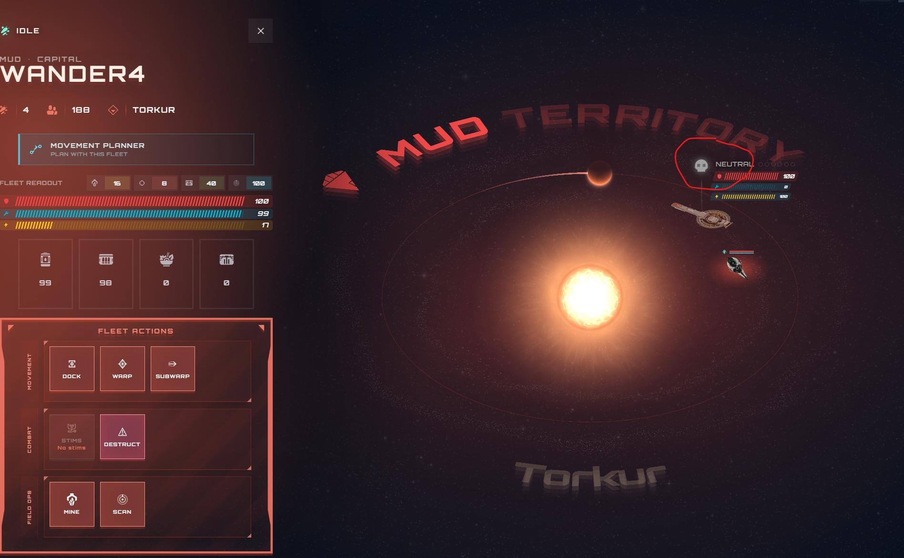
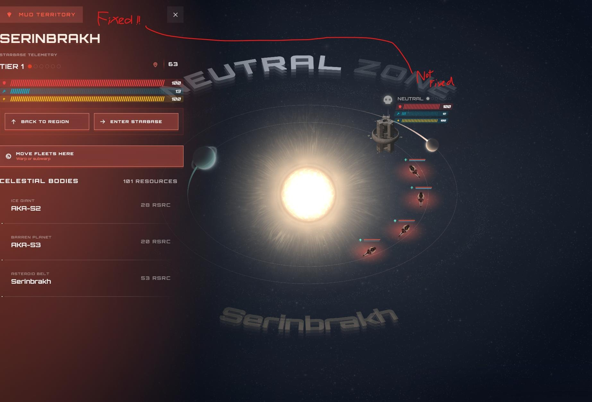
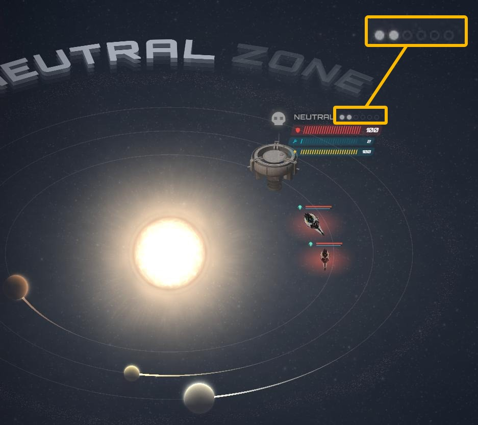

# Bug Report: SAGE Client — Starbase destruction & ownership UI loop

| Field | Value |
|-------|--------|
| **Document type** | Formal client bug report (engineering) |
| **Product** | Star Atlas Golden Era (SAGE) web client |
| **URL** | https://sage.staratlas.com |
| **Component** | Map / system detail / starbase HUD / ownership resolve (Vite + SolidJS + PixiJS) |
| **Severity** | High (territory and siege feedback unusable without full reload) |
| **Date** | 2026-08 |
| **Idea owner / primary investigator** | **Bullit** — identified the broken starbase destruction display loop, drove the fix requirements, documented symptoms with live captures + annotations, and ran the QA that proved each surface |
| **Engineering / write-up** | LEEKS / Produce Bandit ltd (implementation notes, function map, extension packaging; independent — not affiliated with Star Atlas) |
| **Status** | Open for upstream; mitigated via **this public repo** — [SAGE UI Fixes](https://github.com/Harlock-Space-Pirate/sage-ui-fixes) **v1.0.0** |
| **Evidence** | Screenshots in this repo under [`docs/screenshots/starbase-ui/`](./screenshots/starbase-ui/) (Bullit’s field documentation) |

---

## 0. Attribution

**This entire fix line was Bullit’s idea.**

Bullit noticed that after starbase fights the client lied about reality: tier dots stuck, Neutral skulls after ownership flips, borders that would not turn, infocards that gaslit the sector until a hard reload. He did the real work that turns a hunch into an engineering report:

- Scoped the **full UI loop** (map marker → detail border → logo/skull → infocard/tier dots → refetch/ownership)  
- **Documented** before/after and fixed/not-fixed states in the wild  
- **Tested** every surface until Neutral stopped winning by default  
- Brought the product judgment on what “looks correct” after destruction  

LEEKS / Produce Bandit ltd mapped those findings onto stock function names, patch strategy, and the public extension release. Without Bullit’s push, this report and the starbase chrome fixes do not exist.

---

## 1. Focus

This report covers the **full client loop** Bullit specified for **starbase destruction / capture to display correctly**:

1. **Tier dots** drop when starbase level drops (e.g. **2 → 1**)  
2. **Map / detail border** recolors when the starbase is defeated or ownership changes  
3. **Skull / station icon** switches from Neutral (or old faction) to the **winning faction**  
4. **Infocard / hover tooltip** shows correct faction name, color, tier, and “STARBASE DESTROYED” style state  
5. Supporting **refetch + ownership resolve** so the above is not stuck until F5  

Related fleet-pin bugs are listed only as appendix; they are not the focus.

---

## 2. Problem summary

After a successful starbase attack that reduces level, destroys a tier, or flips ownership:

| UI surface | Stock behavior (broken) | Expected (fixed loop) |
|------------|-------------------------|------------------------|
| Tier dots (1–N) | Stay at old level until reload | Track live level (e.g. 2 → 1) |
| System / starbase border | Stays Neutral grey or previous faction | Turns to controlling faction color |
| Skull / station logo | Stuck on Neutral skull | Becomes faction house / logo |
| Infocard / tooltip | “NEUTRAL ZONE”, stale tier, wrong colors | Faction label, live tier, destroyed state |
| Territory banner | Frozen at open-time snapshot | Live `map.systems[id].owner` |

**Root theme:** stock client mixes **snapshot props**, **over-strict ownership gates**, **incomplete post-attack refetch**, and **partial Pixi updates** (warp gates only). Chain can already be correct while every chrome layer lies.

---

## 3. End-to-end loop (what must all fire)

```text
Attack starbase succeeds (tx confirmed)
        │
        ├─► refetch starSystem + factionOwnership   (t=0, 2s, 5s, 10s)
        │         │
        │         ▼
        ├─► resolveDisplayOwner()  → controlling faction from PDA (not seq lag)
        │         │
        │         ▼
        ├─► map.systems[id].owner  updated
        │         │
        ├─► SystemHoverTooltip liveOwner + starbaseLevel memos  → infocard + dots
        ├─► getFactionLogoMaskStyle(liveOwner)                  → skull → faction
        ├─► updateDetailFaction() full detail recreate          → border / ring
        └─► map star core/glow re-tint on owner change          → map marker color
```

If any step is missing, players see Neutral skull, wrong dots, or grey rings until hard reload.

---

## 4. Functions modified (stock minified entry)

Names below are **as they appear in the production Vite entry** (mangled locals may differ per deploy; symbols are the stable hooks).

| # | Function / site | Role in the loop | Failure mode |
|---|-----------------|------------------|--------------|
| 1 | **`resolveDisplayOwner`** | Chooses display faction from `FactionOwnership` map vs fallback system owner | Required `capturedSeqId === systemSeqId` → lags; stays Neutral / old faction |
| 2 | **Starbase attack success handler** (after `Attack starbase transaction sent` / `Tp({… actionLabel: "Attack" …})`) | Only refreshed fleet; did not pull system ownership | Map/HUD never get new owner without reload |
| 3 | **System panel owner `createMemo`** (`It=createMemo(() => ee.system?.owner …)`) | Territory / panel banner | Bound to click-time `ee.system.owner` snapshot |
| 4 | **`updateDetailFaction`** | System detail faction chrome (rings, gates, border) | Only rebuilt warp lanes/gates; border/logo chrome stayed stale |
| 5 | **`SystemHoverTooltip`** | Infocard: faction name/color + **starbase level dots** | Used snapshot `ee.system.owner` and static `ee.system.starbaseLevel` |
| 6 | **`getFactionLogoMaskStyle`** | Skull vs faction station icon mask | Called with `ee.system?.owner` only → Neutral skull after capture |
| 7 | **Map system star update** (loop over systems creating/updating `_starCore` / `_starGlow`) | Map pin color + logo texture | Early-continue when pin exists → never re-tint on owner change |
| 8 | **Starbase map HP fraction** (inline where `Nc.hp` / `Nc.pendingHp` used) | Map HP bar | `hp/(hp+pendingHp)` → false 100%; bar ignored in dirty fingerprint |

### 4.1 Level dots (2 → 1) — detail

**Function:** `SystemHoverTooltip` level memo (`ft` / starbase level).

Stock used only `ee.system.starbaseLevel` from the open-time system object.

Correct behavior must:

1. Prefer live `map.systems[systemId].starbaseLevel`  
2. Prefer on-chain starbase account `level` from `starSystems` store when present  
3. When starbase `hp <= 0` and level &gt; 0, treat displayed tier as **level − 1** (destroyed top tier) so dots drop immediately (e.g. 2 → 1)

Without this, dots freeze at the pre-fight tier until reload.

### 4.2 Border + detail ring — detail

**Function:** `updateDetailFaction(detailView, faction)`.

Stock destroyed warp lane/gate sprites and recreated connections only, then set `Se.faction = nt`. That is insufficient for starbase **border / faction shell**.

Mitigation: **`removeDetailView` + `createDetailView`** (full recreate) so faction color, rings, and station chrome rebuild together.

### 4.3 Skull → faction icon — detail

**Functions:** `SystemHoverTooltip` → `liveOwner()`; **`getFactionLogoMaskStyle(owner, color)`**.

Logo mask must use **live** owner (`liveOwner() ?? ee.system?.owner`), not the frozen prop. Same live owner drives map `_starCore` texture via `convertOwnerToFaction` + faction texture map.

### 4.4 Infocard faction / destroyed copy — detail

**Function:** `SystemHoverTooltip`.

Faction chip (`getFactionName$1` / `getFactionColor$1`) must subscribe to `liveOwner()`. Combined with live level memo, the card shows e.g. **USTUR · STARBASE DESTROYED** and the correct number of tier dots.

---

## 5. Recommended first-party fixes (by function)

### `resolveDisplayOwner(systemId, fallbackOwner, ownershipMap, ctx)`

- Prefer PDA when `gameId` matches, `hasStarbase`, and `controllingFaction ∈ {1,2,3}`.  
- Do **not** hard-require `capturedSeqId === systemSeqId` for display (treat as soft consistency).

### Attack success path

After confirmed starbase attack:

```text
await refetch.starSystem()
await refetch.factionOwnership()
schedule same at +2s, +5s, +10s (coalesced)
```

### System panel owner memo

```text
owner = map.systems[systemId].owner ?? props.system.owner ?? Unaligned
```

### `updateDetailFaction`

Full detail recreate on faction change (or dedicated border/logo update path that runs whenever owner changes).

### `SystemHoverTooltip`

- `liveOwner` from `useDataSource().store.state.map.systems`  
- Level from live map + starbase account; apply hp≤0 tier step-down  
- Pass `liveOwner` into `getFactionLogoMaskStyle`

### Map star / pin update

If a pin already exists and **owner changed**, update `_saOwner`, re-tint `_starGlow` / `_starCore`, swap faction texture — do not `continue` as no-op.

### HP bar (supporting)

Use max hull from config/level, not `hp/(hp+pendingHp)`. Include HP (or level) in map dirty fingerprint.

---

## 6. Screenshots (evidence)

All evidence images ship in **this repository** under [`docs/screenshots/starbase-ui/`](./screenshots/starbase-ui/).

**How to view:** thumbnails are small. **Click the triangle / summary** to enlarge. Enlarge mode includes a **LEEKS dirty caption** so you know who smuggled the commentary in (Bullit did the real documentation; LEEKS did the filth in the footnotes).

### 6.0 Field documentation (Bullit) + annotation provenance

Evidence set originates from **Bullit’s live siege documentation** — he captured the broken and fixed states, labeled what still lied, and kept iterating until the loop held. That is the source material for this report, not an afterthought.

Hand-annotations (circles, arrows, “Fixed!! / Not Fixed”) are his production markup during QA. Critics will say it looks like a raccoon discovered MS Paint. We prefer: **creative masterminds are always misunderstood in their own time.** Van Gogh had ear drama; Bullit has red squiggles over Neutral Zone. Same trajectory, better FPS.

Treat the scribbles as **semantic markup** for engineers, not as a pitch for an NFT collection (if someone floors one, Produce Bandit ltd is not involved).

---

### fig-01 — Map marker after fight (faction border / chrome)

| | |
|--|--|
| **Shows** | Faction-colored territory / station chrome in siege context (not stuck pure Neutral grey) |
| **Functions** | Map star re-tint · `resolveDisplayOwner` · post-attack refetch |

<details>
<summary>
<br />
<em>▸ click to enlarge — LEEKS is waiting in there</em>
</summary>

> **LEEKS (enlarged edition):** Look at that ring. Stock client wanted you to keep believing in **Neutral forever** like a toxic ex that never updates their status. We made the chrome climax when ownership does. You’re welcome. If this screenshot gets you hotter than the starbase AP bar, seek help — or ship more patches.

<p align="center">
  
</p>

</details>

---

### fig-04 — System detail border + station

| | |
|--|--|
| **Shows** | System detail: border/ring + station chrome; Bullit “Fixed!! / Not Fixed” markup where stock lagged |
| **Functions** | `updateDetailFaction` (full recreate) · live ownership |

<details>
<summary>
<br />
<em>▸ click to enlarge — LEEKS rates the scribble art</em>
</summary>

> **LEEKS (enlarged edition):** Half the frame is still gaslighting you; half is fixed — classic mid-session edge. Bullit’s squiggles are **not** bad art; they are the only honest API docs SAGE shipped that week. Creative masterminds die poor; we just commit their crayons to git. Also: if your detail view only rebuilds warp gates and forgets the starbase skirt, that’s not a “minor polish” issue — that’s leaving the base undressed in public.

<p align="center">
  
</p>

</details>

---

### fig-05 — Infocard / tier dots

| | |
|--|--|
| **Shows** | Infocard tier dots + Neutral/faction presentation Bullit marked during QA (level / ownership chrome) |
| **Functions** | `SystemHoverTooltip` · level memo · `getFactionLogoMaskStyle` |

<details>
<summary>
<br />
<em>▸ click to enlarge — LEEKS on dots going down</em>
</summary>

> **LEEKS (enlarged edition):** When the tier dots drop **2 → 1**, that’s the starbase losing a life in public. Stock UI kept the full pearl necklace of dots like nothing happened. We made the striptease match the chain. If you only came here for the dirty caption: hi, I’m LEEKS, Produce Bandit ltd — we fix your space porn and document it.

<p align="center">
  
</p>

</details>

---

### Expected visual checklist (post-fix)

- [ ] Tier dots match live level (drop **2 → 1** when tier lost)  
- [ ] Border/ring matches controlling faction (not stuck Neutral)  
- [ ] Skull becomes faction station logo when owned / after defeat flip  
- [ ] Infocard faction string + colors match map marker  
- [ ] No full page reload required after attack confirms  

---

## 7. Verification procedure

1. Engage a starbase with visible multi-tier dots (level ≥ 2).  
2. Land hits until level drops or ownership flips.  
3. **Without reload**, confirm all of §6 checklist on: map pin, system detail, hover/infocard.  
4. Optionally hard-reload once — UI must already match chain; reload must not be the “fix.”

---

## 8. Mitigation status (community)

| | |
|--|--|
| Extension | [SAGE UI Fixes](https://github.com/Harlock-Space-Pirate/sage-ui-fixes) **v1.0.0** |
| Mechanism | Entry-module string patches before first eval (MV3) |
| Product idea / QA / field docs | **Bullit** |
| Engineering / packaging | LEEKS / Produce Bandit ltd |
| Note | Fragile across minifier renames; first-party fixes should land in source |

---

## Appendix A — Other client bugs (out of primary focus)

| ID | Topic | Hook |
|----|--------|------|
| A1 | Destroyed **fleets** remain on map | Fleet map early-return: add `Destroyed` next to Docked/Respawn |
| A2 | Dead fleets in combat target list | `nearbyFleets.filter` — exclude `Destroyed` / hp≤0 |

---

## Appendix B — Symbol map (mitigation ↔ stock)

| Mitigation intent | Stock symbols touched |
|-------------------|------------------------|
| Ownership resolve | `resolveDisplayOwner` |
| Post-attack sync | attack success chain + `Kt.refetch.starSystem` / `Kt.refetch.factionOwnership` |
| Panel banner | owner `createMemo` on system panel |
| Detail border | `updateDetailFaction`, `removeDetailView`, `createDetailView` |
| Infocard + dots | `SystemHoverTooltip`, `getFactionName$1`, `getFactionColor$1` |
| Logo / skull | `getFactionLogoMaskStyle` |
| Map marker | `_starCore`, `_starGlow`, `getFactionColorFromOwner`, `convertOwnerToFaction`, `cachedColorNumber` |

---

**Idea, documentation effort, and QA:** Bullit  
**Engineering write-up / extension shipping:** LEEKS / Produce Bandit ltd  
**Disclaimer:** Independent client analysis for engineering triage. Not an official Star Atlas document.
